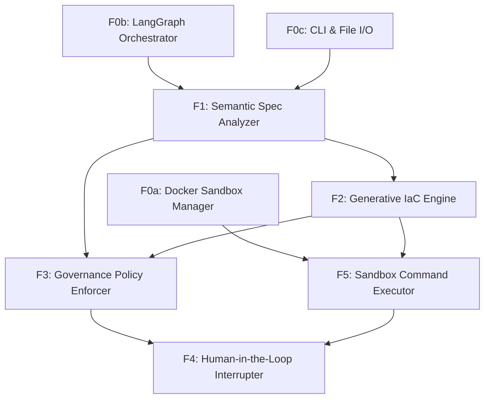

# Feature Map

## Features

| ID | Name | Type | Size | Dependencies |
|----|------|------|------|--------------|
| F0a | Docker Sandbox Manager | foundation | medium | — |
| F0b | LangGraph Orchestrator | foundation | medium | — |
| F0c | CLI & File I/O | foundation | small | — |
| F1 | Semantic Spec Analyzer | product | medium | F0b, F0c |
| F2 | Generative IaC Engine | product | large | F1 |
| F3 | Governance Policy Enforcer | product | medium | F1, F2 |
| F4 | Human-in-the-Loop Interrupter | product | medium | F3, F5 |
| F5 | Sandbox Command Executor | product | medium | F0a, F2 |

## Milestones

### M0: Sandbox Foundation

**Goal:** Establish the secure runtime facility and agent state management core.

**Exit Criteria:**
- CLI can successfully spin up and tear down a Docker container
- LangGraph state machine correctly processes dummy inputs

**Features:** F0a, F0b, F0c

### M1: Autonomous Scaffolding

**Goal:** Enable the automated scaffolding capability and code generation.

**Exit Criteria:**
- Agent converts design.md to valid Terraform files
- Agent successfully executes 'terraform plan' inside the sandbox
- End-to-end scaffolding time under 30 minutes for a basic service

**Features:** F1, F2, F5

### M2: Governance & Control

**Goal:** Implement the safety guardrails and human-in-the-loop controls.

**Exit Criteria:**
- Agent halts on artificial policy violations in requirements.md
- User can modify a script during a halt state and resume execution
- 100% of generated code passes syntax validation before output

**Features:** F3, F4

## Dependency Graph

